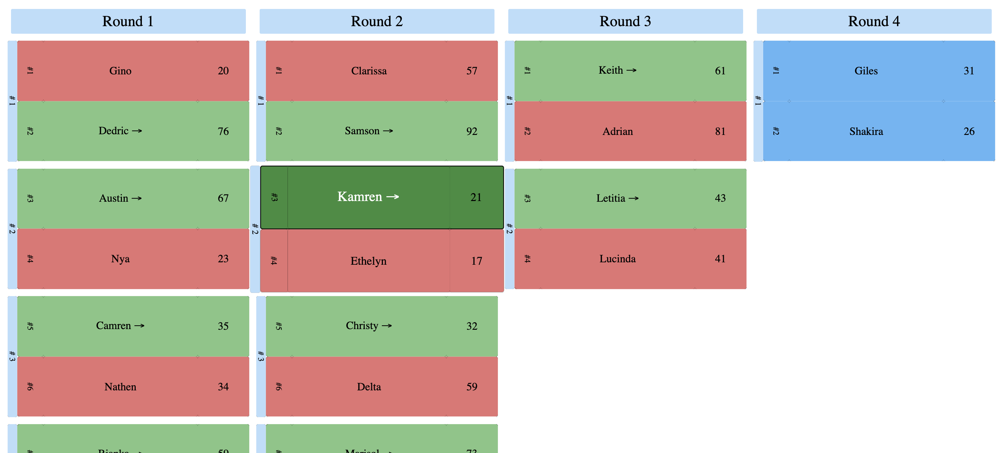

       

[](https://www.npmjs.com/package/react-tournament)

# react-tournament
🏆 React Tournament component 🔝

## Demo

__[React Stories are available here](https://yankouskia.github.io/react-tournament/check)__

__[DOCs are available here](#DOCS)__

Usage
:-------------------------:


700 width table
:-------------------------:


Auto width table
:-------------------------:


Big table
:-------------------------:


Table with custom styles
:-------------------------:


## How to use

To install package:

```sh
# npm
npm install react-tournament --save

#yarn
yarn add react-tournament
```

Use in JS:

```js
// CommonJS
const { ReactTournament } = require('react-tournament');
// or
const ReactTournament = require('react-tournament').default;

// ES6 modules
import { ReactTournament } from 'react-tournament';
//or
import ReactTournament from 'react-tournament';

// In browser
const ReactTournament = window.ReactTournament;
```

Render in JavaScript:

```js
export const Table = ({
  aspectRatio,
  data,
  theme,
  width,
}) => (
  <ReactTournament
    aspectRatio={aspectRatio}
    data={data}
    theme={theme}
    width={width}
  />
)
```

## DOCS

The only component exposed in library is `ReactTournament` component. All props usage is described below:

```js
ReactTournament.propTypes = {
  aspectRatio: PropTypes.number,
  data: PropTypes.arrayOf(
    PropTypes.arrayOf(
      PropTypes.arrayOf(PropTypes.shape({
        isWinner: PropTypes.bool,
        user: PropTypes.string.isRequired,
        userLink: PropTypes.string,
        score: PropTypes.number.isRequired,
        scoreLink: PropTypes.string,
      })),
    ),
  ).isRequired,
  theme: PropTypes.shape({
    primary: PropTypes.shape({
      default: PropTypes.string,
      dark: PropTypes.string,
      darkest: PropTypes.string,
      light: PropTypes.string,
    }),
    success: PropTypes.shape({
      default: PropTypes.string,
      dark: PropTypes.string,
      darkest: PropTypes.string,
      light: PropTypes.string,
    }),
    fail: PropTypes.shape({
      default: PropTypes.string,
      dark: PropTypes.string,
      darkest: PropTypes.string,
      light: PropTypes.string,
    }),
    textSmall: PropTypes.string,
    textMedium: PropTypes.string,
    textLarge: PropTypes.string,

    textDark: PropTypes.string,
    textLight: PropTypes.string,
  }),
  width: PropTypes.string,
};
```

### Props

### `aspectRatio`

Prop `aspectRatio` is designed to set a ratio of width and height. `aspectRatio` is `2` means that pair box's width 2 times more than height

### `data`

Prop `data` is designed to pass information about users in tournament. `data` should be passed as `array` of rounds. Each round is `array` of `pair`s. Each `pair` is `array` with length equals 2 of people (`oponent`s). Each `oponent` has next shape:

```js
shape({
  isWinner: PropTypes.bool,
  user: PropTypes.string.isRequired,
  userLink: PropTypes.string,
  score: PropTypes.number.isRequired,
  scoreLink: PropTypes.string,
})
```

Example:
```js
const data = export const data = [
  // 1st round
  [
    // 1st pair
    [
      // 1st person
      {
        user: 'yankouskia',
        userLink: 'https://github.com/yankouskia',
        score: 87,
        scoreLink: 'https://github.com/yankouskia/react-tournament',
        isWinner: true,
      },
      // 2nd person
      {
        user: 'Alex',
        userLink: 'https://github.com/yankouskia',
        score: 32,
        scoreLink: 'https://github.com/yankouskia/react-tournament',
      }
    ],
    // 2nd pair
    [
      // 3rd person
      {
        user: 'yankouskia',
        userLink: 'https://github.com/yankouskia',
        score: 56,
        scoreLink: 'https://github.com/yankouskia/react-tournament',
        isWinner: true,
      },
      // 4th person
      {
        user: 'Alex',
        userLink: 'https://github.com/yankouskia',
        score: 54,
        scoreLink: 'https://github.com/yankouskia/react-tournament',
      }
    ]
  ],
  // 2nd round
  [
    // 1st pair
    [
      // 1st person
      {
        user: 'yankouskia',
        userLink: 'https://github.com/yankouskia',
        score: 34,
        scoreLink: 'https://github.com/yankouskia/react-tournament',
      },
      // 2nd person
      {
        user: 'Alex',
        userLink: 'https://github.com/yankouskia',
        score: 98,
        scoreLink: 'https://github.com/yankouskia/react-tournament',
      }
    ]
  ],
];
```

### `theme`

Prop `theme` is designed to create custom styles for the tournament table. `theme` props has next shape:

```js
shape({
  primary: PropTypes.shape({
    default: PropTypes.string,
    dark: PropTypes.string,
    darkest: PropTypes.string,
    light: PropTypes.string,
  }),
  success: PropTypes.shape({
    default: PropTypes.string,
    dark: PropTypes.string,
    darkest: PropTypes.string,
    light: PropTypes.string,
  }),
  fail: PropTypes.shape({
    default: PropTypes.string,
    dark: PropTypes.string,
    darkest: PropTypes.string,
    light: PropTypes.string,
  }),
  textSmall: PropTypes.string,
  textMedium: PropTypes.string,
  textLarge: PropTypes.string,

  textDark: PropTypes.string,
  textLight: PropTypes.string,
})
```

*Any* or *all* values could be overrided. Custom configuration will be merged with default one. Default theme is next:

```js
{
  primary: {
    default: '#64b5f6',
    dark: '#1565c0',
    darkest: '#002171',
    light: '#bbdefb',
  },
  success: {
    default: '#81c784',
    dark: '#388e3c',
    darkest: '#003300',
    light: '#c8e6c9',
  },
  fail: {
    default: '#e57373',
    dark: '#c62828',
    darkest: '#7f0000',
    light: '#ffcdd2',
  },
  textSmall: '12px',
  textMedium: '16px',
  textLarge: '22px',

  textDark: '#000000',
  textLight: '#ffffff',
};
```

### `width`

Prop `width` is designed to set width for the tournament table. Value `auto` is applied for `width` prop by default. Could be any `CSS` valid value (`800px`, `auto`, `50%`, ...).


## Support

You can support via  


## Restriction

`React >=16.0.0` and `styled-components >=4.0.0` should be installed for using this library

## Contributing

`react-tournament` is open-source library, opened for contributions

### License

react-tournament is [MIT licensed](https://github.com/yankouskia/react-tournament/blob/master/LICENSE)
